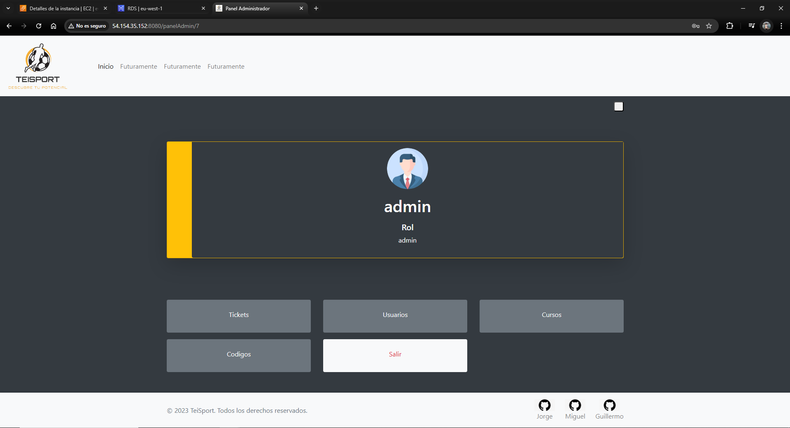

# Indice 
 - [Supuesto](#Supuesto)
 - [Diagrama de Clases](#Diagrama-de-clases)
 - [Manual Técnico para Desarrolladores](#Manual-técnico-para-desarrolladores)
 - [Manual de Usuario](#Manual-de-Usuario)
 - [GitProject & Issues](#GitProject-e-Issues)
 - [Extras Realizados](#Extras-realizados)
 - [Propuestas de Mejora](#Propuestas-de-mejora)
 - [Conclusiones](#Conclusiones)
 - [Dedicación Temporal](#Dedicación-temporal)

# Supuesto

Nuestro proyecto de Springboot Teisport lo hemos planteado de forma que fuese útil para la persona creada con el mapa de
empatía utilizado en clase. En nuestro caso , Carlitos era un adolescente de 16 años que jugaba en un equipo de fútbol 
con sus amigos, pero solía estar más en el banquillo que jugando. 

Para poner solución a su problema planteamos Teisport. Una plataforma de cursos gratuitos y de pago en la que ofrecemos 
cursos con vídeos, guías y documentación creada por técnicos para ayudar a la mejora técnica, física y táctica de
jóvenes jugadores. 

# Diagrama de clases

Para ello hemos planteado la siguiente BD , representada en este diagrama ER.

La entidad principal es la de Usuario. En el momento en el que se registra este accede a su Cuestionario Inicial. 
Una vez lo responde se lñe asignarán varios Planes de Entrenamiento en función de sus respuestas. Cada plan por su parte
tendrá un Contenido específico. A mayores los Usuarios podrán tener un Código de Descuento y podrán poner Tickets 
con Mensajes en caso de necesitar sporte por parte de los Usuarios Administradores.

# Manual Técnico para Desarrolladores

Para el desarrollo de nuestra aplicación web son necesarias las siguientes herramientas: 

- Springboot 2.7.14 

- Java 17.0.3 o superior.

- MySQL 8.0.33 (BD Local)

- RDS en AWS con verisión MySQL 8.0.33

- IntelliJ u otro IDE que permita el desarollo con las herramientas mencionadas.

## Estructura 

Para la realización del proyecto hemos utilizado un patrón por Capas.

Este modelo se suele usar en Spring Boot para aplicaciones web tradicionales con vistas renderizadas en el servidor. Se organizarían en los siguientes apartados que veremos a cotninuación.

## Presentación

Maneja las solicitudes HTTP e interactúa con la capa de servicios.
Devuelve respuestas al cliente . En nuestro caso vistas , ya que es una aplicación web.

## Servicio

Contiene la lógica de negocio y actúa como intermediario entre los controladores y los repositorios.

## Acceso a Datos

Se comunica con la base de datos y ejecuta las operaciones CRUD (Create, Read, Update, Delete) mediante JPA o consultas personalizadas
en el caso de que necesitemos alguna consulta de campos concretos, ciertas relaciones ,etc.

## Modelo o Dominio

Representa los datos del negocio. Se mapea a tablas en la base de datos con JPA.

# Manual de Usuario

Os dejamos un pequeño video tutorial del funcionamiento de la aplicación tanto desde la parte de usuarios como administradores.

# GitProject e Issues

Para el reparto de tareas usamos el sistema de Issues de GitHub. Asignando a las Issues un miembro del gurpo o varios 
y asignando una pull request para que pasase a completada en el momento en el que alguno de los miembros revisase la pull
y la aceptase. 

Trabajmos en común para la creación de la BD, las Entities, los DTOs. Después cada uno trabajó 
de froma individual en sus views, CRUDs , etc. Obviamente con la ayuda de sus compañeros si era necesario y consultándonos 
todos para temas de diseño, estructuración etc. Hemos trabajado en común varios días cuando nos lo permitian nuestros horarios
y de forma individual otros , pero siempre nos hemos puesto al día y comentado puntos del proyecto los días de clase.

- **Issues Jorge.**

- **Issues Miguel.**

- **Issues Guille.**

# Propuestas de mejora

Como propuestas de mejeora de nuestro proyecto:

- Filtrado de algunos campos en distintas vistas que no hemos podido implementar por tiempo.

- Referenciar distintas vistas en el header para tener acceso a distintas partes de la app desde este.

- Implementar alguna forma de subir contenido multimedia para los planes de entrenamiento.

- Personalizar las fotos de perfil del usuario. (Intentamos hacerlo , pero se dejó como tarea secundaria 
para los ultimos días de trabajo)

- Validación de más campos de los formularios.

# Extras realizados

- Dashboard para el administrador de usuarios que acceden a nuestra aplicación (podrá crear, modificar, bloquear y borrar usuarios).

- Despliegue con Docker: la aplicación estará publicada en una instancia dockerizada EC2 de AWS o Azure, conectándose a una base de datos MySQL publicada en Azure o AWS-RDS.
  En nuestro caso hemos usado un [servidor Ubuntu en AWS](http://54.154.35.152:8080/).

# Conclusiones

Hemos sacado varias conclusiones con la finalización de este proyecto: 

- Al inicio del proyecto nos encontrábamos bastante perdidos en cuanto a conocimientos de como funcionaba Springboot. 
Pero a medida que hemos ido avanzando creo que hemos comprendido mejor su funcionamiento y potencial.

- A comparación de JavaFX , Springboot hace mucho más sencillo y felixble el diseño de la interfaz de la app. 
Además de tener muchas más opciones de diseño.

- En general la parte de Controllers es también mucho más sencilla. Al igual que la forma en la 
que se hacen los CRUD con los Repository y Services es mucho más sencilla.

- De la misma forma que en el primer proyecto tuvimos dificultades con JavaFX , las tuvimos aquí con Springboot.
Pero a medida que fuimos avanzando en el proyecto y solucionando errores fuimos aprendiendo a como manejar mejor 
Springboot. Probar nuevas tecnologias, construir un proyecto con ellas, cometer errores y solucionarlos ayuda mucho a
aprender como manejarla.

# Dedicación temporal

Desde el inicio del proyecto hemos dedicado entre las horas de clase y trabajo en casa una media estimada de unas 40h 
cada uno más o menos.

# Cualificación esperada

Teniendo en cuenta los puntos exigidos entre tareas Obligatorias y Opcionales la cualificación estimada del grupo es 
un 80 sobre 100.
